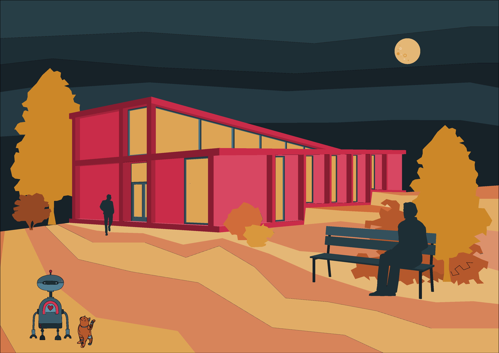
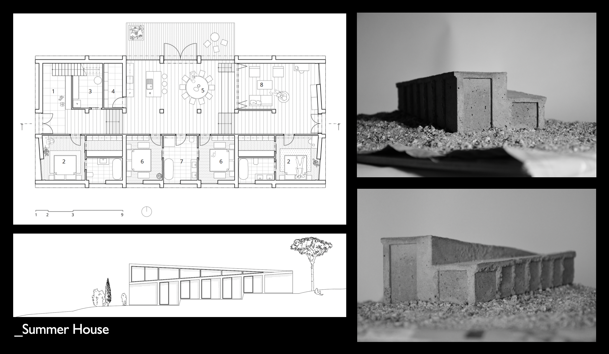
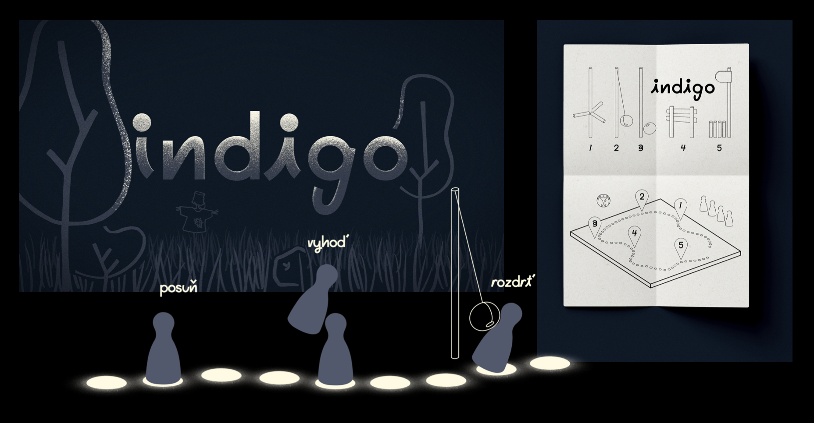
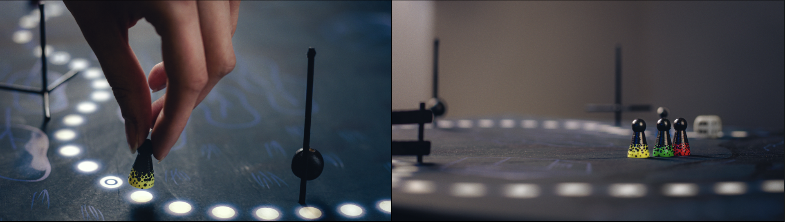
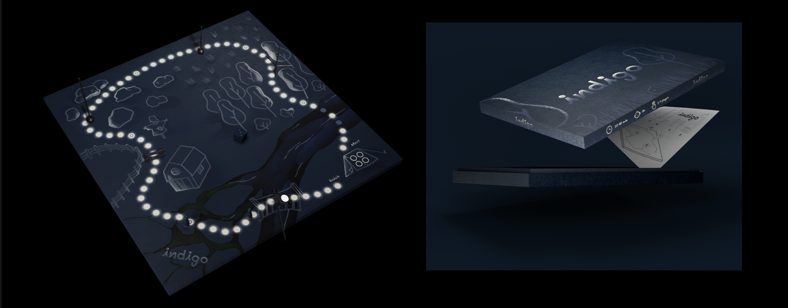
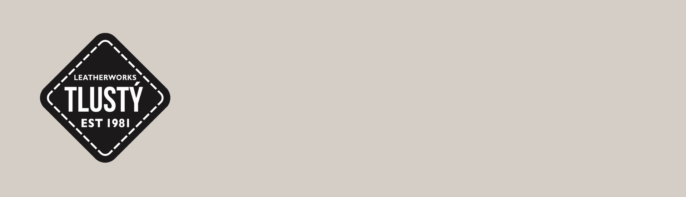

#First Impression

### about me:
Ahoy! I am Terézia Michalcová and I am a graphic designer. My creative journey started at Faculty of Architecture where my main interests shifted and those led me more into visual communication. Now I create brand identities and I enjoy the creative process behind it.

### Summer House (architecture)

My university journey started at architecture. Where the spark for graphic design lighted up in me. This particular project I designed for Czech actress Lenka Zbranková in Sázava as her summer house. Lovely environment of the countryside and her delicate personality led me to designing spacious common areas for her lively entertaining and calm, simple private rooms for her to unwind and recharge after long day. I learned to listen to the client, work with space and materials. 

But my path led me more into graphic design...

### Czech School without Borders, London (visual identity)

This is a visual identity for Czech School without Borders, London and together we designed a versatile visual system, reflecting the unique and creative educational process of the school. We created a playful iconography based on sticker like appearance. It is not only fun element but also practical tool to classify all the activities the school provides. We wanted to incorporate children themselves to be part of their school identity by using their precious artworks and creations. 

### Indigo (board game)

At the end of the second year of college we got a lovely assignment to create a unique board game. Working in team we approached this a little unconventionally. We paired classic game pieces moving forward a designated route with physical obstacles that can throw your game pieces out of game. Inspired by mechanics of video game Fall guys, or real life version Total Wipeout we mashed the two ideas and added a theme of a children's camp night games. 

The path lighting up the way through different, moody environments leading you back to the safety of the camp. But beware! There are obstacles you need to get past to. May the luck be ever in your favour!

### Leatherworks Tlustý (brand identity, rebranding)

Brašnářství Tlustý is a Czech company engaged in production of products that contain very high quality leather from Italy and are processed by hand. 
The current logo has an element of seams or stitching - element not used by competitors - it is distinctive to the company and is already familiar to the current customer base. It is easy to animate and apply. Its practicality and uniqueness to the trade made it clearly main element in the company's visual language. 

